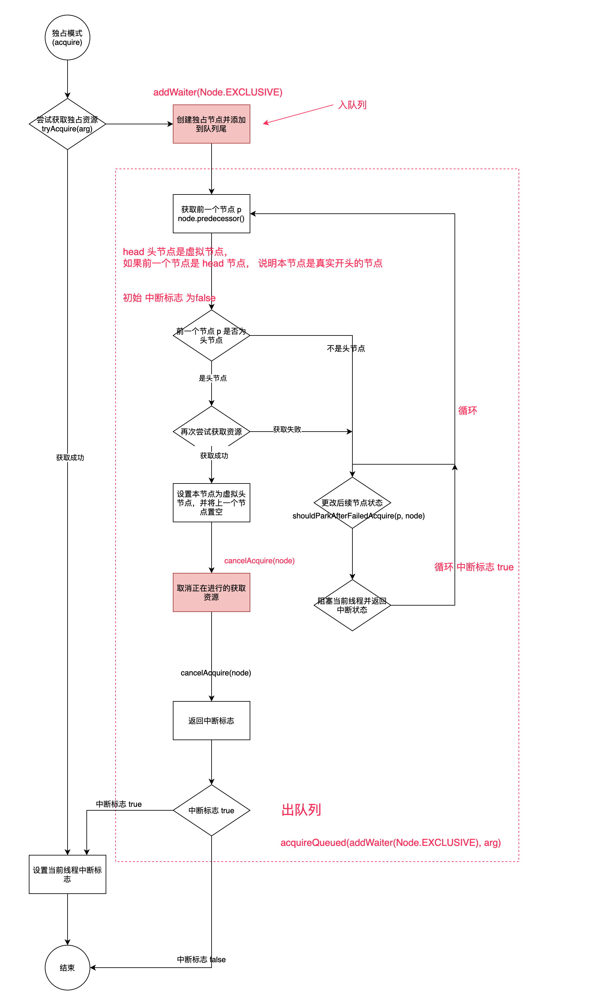
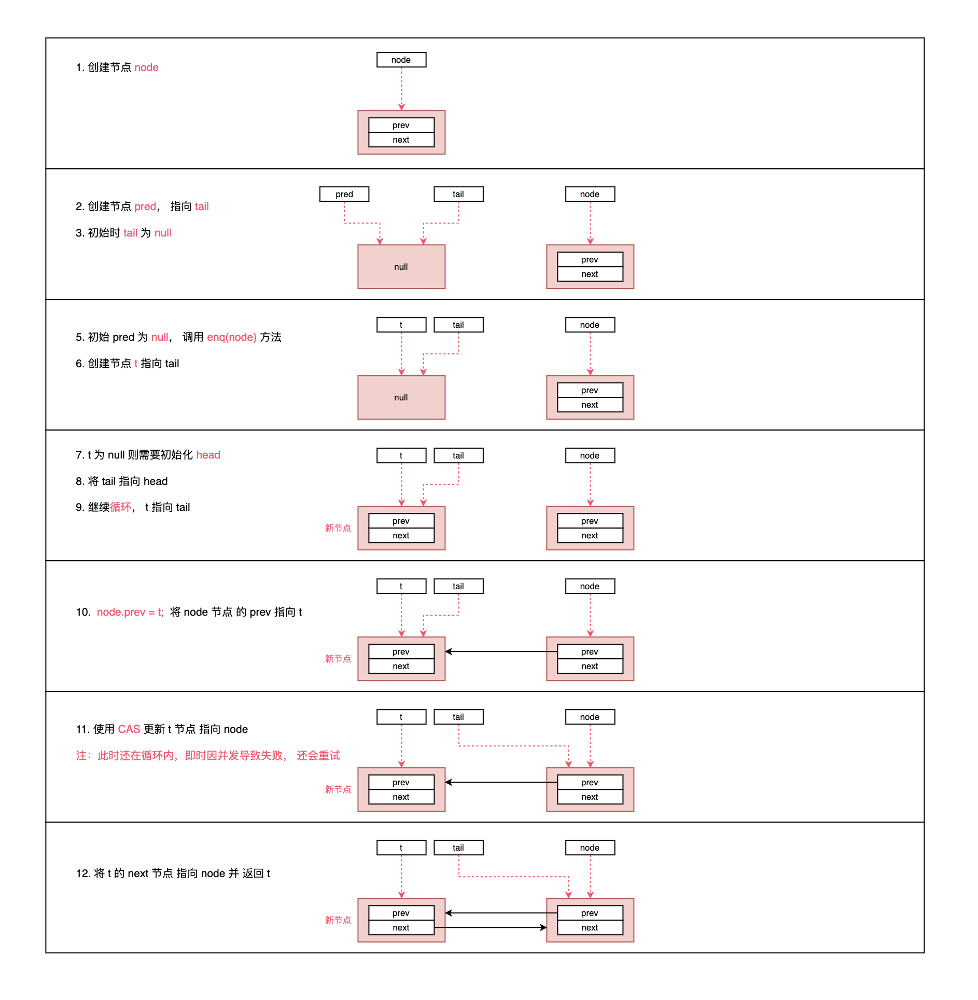
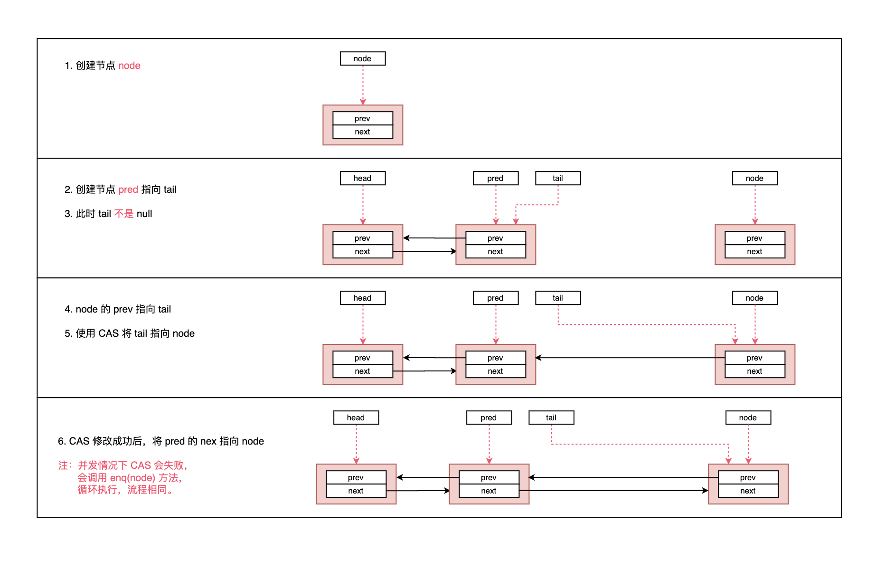
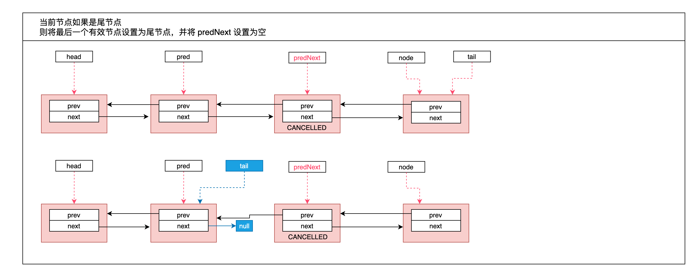
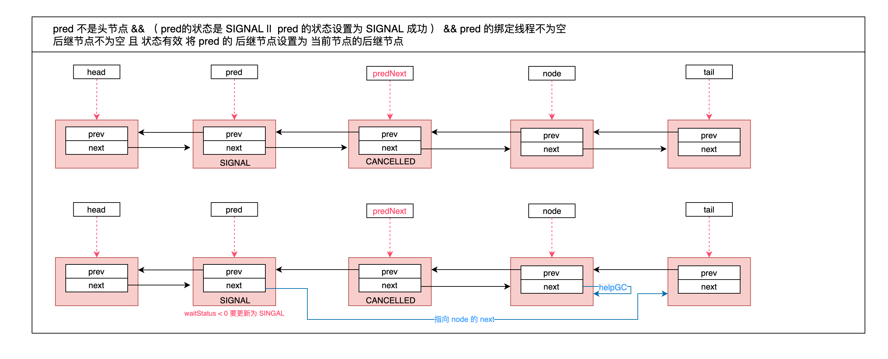
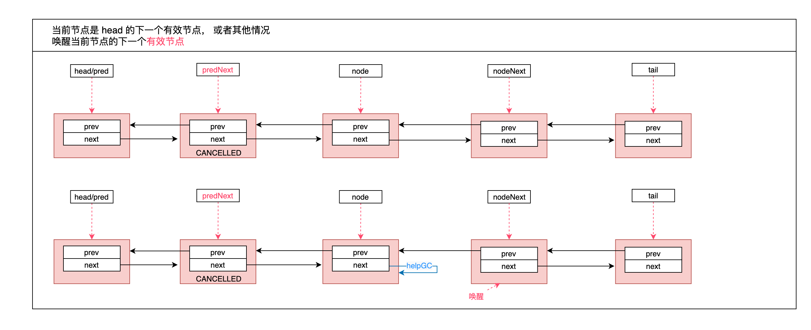

###AQS源码解析

#### 独占模式
流程图:

#### CLH队列

1. 入队，初始化队列

2. 入队，队列已存在

3. 出队

#### QA
#####Q: AQS 到底是什么？
#####A: AQS 内部提供了一个先入先出（FIFO）双向等待队列，内部依靠 Node 实现，并提供了在独占模式和共享模式下的出入队列的公共方法。而关于状态信息 state 的定义是由子类实现。tryAcquire、tryRelease、tryAcquireShared、tryReleaseShared等尝试获取资源操作都是由子类进行定义和实现的。而 AQS 中提供了子类获取资源之后的相关操作，包括节点 Node 的出入队列，自旋获取资源等等。

#####Q: AQS 获取资源失败后会如何操作？
#####A: 线程获取资源失败后，会放到等待队列中，在队列中会不断尝试获取资源（自旋），说明线程只是进入等待状态，后面还是可以再次获取资源的。

#####Q: AQS 等待队列的数据结构是什么？
#####A: CLH变体的先入先出（FIFO）双向等待队列。（CLH锁是一个自旋锁。能确保无饥饿性。提供先来先服务的公平性。是一种基于链表的可扩展、高性能、公平的自旋锁，申请线程仅仅在本地变量上自旋，它不断轮询前驱的状态，如果发现前驱释放了锁就结束自旋。）

#####Q: AQS 等待队列中的节点如何获取获取和释放资源的？
#####A: 可以看下独占模式中的讲述过程，通过代码梳理。

#####Q: 通过图可以看出来，只操作了 next 指针，但是没有操作 prev 指针，这是为什么呢？
#####A: 在出队列：acquireQueued(addWaiter(Node.EXCLUSIVE), arg) 方法中，shouldParkAfterFailedAcquire 方法会判断前一个节点的状态，同时取消在队列中当前节点前面无效的节点。这时候会移除之前的无效节点，此处也是为了防止指向一个已经被移除的节点。同时保证 prev 的稳定，有利于从 tail 开始遍历列表，这块在 unparkSuccessor(node); 中也可以看到是从后往前表里列表。

#####Q: unparkSuccessor(Node node) 为什么从后往前遍历？
#####A: 在 addWaiter(Node.EXCLUSIVE) 插入新节点时，使用的是 尾插法，看红框部分，此时有可能还未指向next。

#####Q: node.next = node; 这块导致 head不是指向最新节点，链表不就断了么？
#####A： acquireQueued 方法介绍中，里面有个循环，会不断尝试获取资源，成功之后会设置为 head。并且在 shouldParkAfterFailedAcquire 中也会清除当前节点前的无效节点。