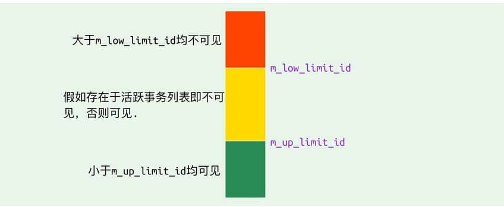

###事务可见性示意图

###RC 和 RR 隔离级别下 MVCC 的差异
>在事务隔离级别 RC 和 RR （InnoDB 存储引擎的默认事务隔离级别）下，InnoDB 存储引擎使用 MVCC（非锁定一致性读），但它们生成 Read View 的时机却不同在
####RC 隔离级别下的 每次select 查询前都生成一个Read View (m_ids 列表)
####RR 隔离级别下只在事务开始后 第一次select 数据前生成一个Read View（m_ids 列表）

###MVCC➕Next-key-Lock 防止幻读
InnoDB存储引擎在 RR 级别下通过 MVCC和 Next-key Lock 来解决幻读问题：
1. 执行普通 select，此时会以 MVCC 快照读的方式读取数据在快照读的情况下，RR 隔离级别只会在事务开启后的第一次查询生成 Read View ，并使用至事务提交。所以在生成 Read View 之后其它事务所做的更新、插入记录版本对当前事务并不可见，实现了可重复读和防止快照读下的 “幻读”
2. 执行 select...for update/lock in share mode、insert、update、delete 等当前读在当前读下，读取的都是最新的数据，如果其它事务有插入新的记录，并且刚好在当前事务查询范围内，就会产生幻读！  
InnoDB 使用 Next-key Lockopen in new window 来防止这种情况。当执行当前读时，会锁定读取到的记录的同时，锁定它们的间隙，防止其它事务在查询范围内插入数据。只要我不让你插入，就不会发生幻读
