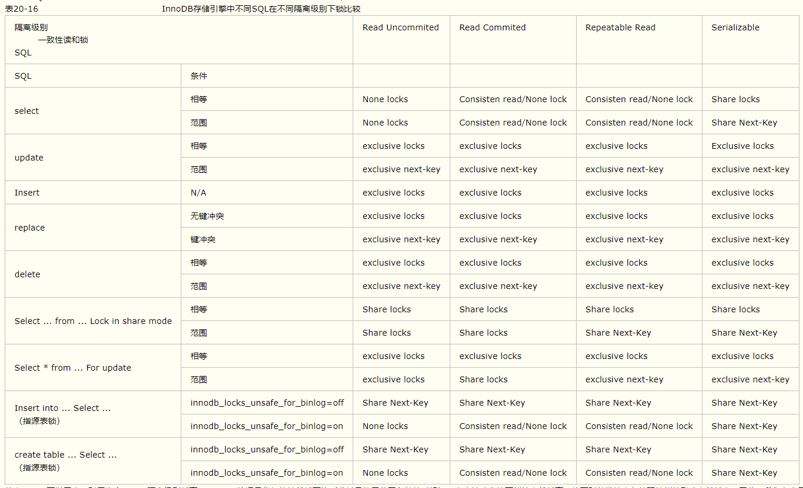

#### 锁互斥的情况：
1. 不走索引，直接锁表
2. 行锁是针对索引加锁，所以使用相同索引的不同行都会被加锁
3. 多个索引时，会使用行锁对数据加锁！所以即使索引不同，但是也会互斥
#### 间隙锁：
1. 解决幻读问题
2. 解决数据恢复与复制问题
   insert aa select * from bb
   create table aa select * from bb
   不加间隙锁，会导致binlog中的sql顺序错误。虽然结果一致

#### myISAM 表锁
在自动加锁的情况下也基本如此，MyISAM总是一次获得SQL语句所需要的全部锁。这也正是MyISAM表不会出现死锁（Deadlock Free）的原因  
当使用LOCK TABLES时，不仅需要一次锁定用到的所有表，而且，同一个表在SQL语句中出现多少次，就要通过与SQL语句中相同的别名锁定多少次，否则也会出错！
##### myISAM 并发插入
MyISAM存储引擎有一个系统变量`concurrent_insert`，专门用以控制其并发插入的行为，其值分别可以为0、1或2。
- 当`concurrent_insert`设置为0时，不允许并发插入。
- 当`concurrent_insert`设置为1时，如果MyISAM表中没有空洞（即表的中间没有被删除的行），MyISAM允许在一个进程读表的同时，另一个进程从表尾插入记录。这也是MySQL的默认设置。
- 当`concurrent_insert`设置为2时，无论MyISAM表中有没有空洞，都允许在表尾并发插入记录。
通过定期在系统空闲时段执行 OPTIMIZE TABLE语句来整理空间碎片，收回因删除记录而产生的中间空洞

#### InnoDB 行锁
InnoDB实现了以下两种类型的行锁。
- 共享锁（S）：允许一个事务去读一行，阻止其他事务获得相同数据集的排他锁。
- 排他锁（X)：允许获得排他锁的事务更新数据，阻止其他事务取得相同数据集的共享读锁和排他写锁。
另外，为了允许行锁和表锁共存，实现多粒度锁机制，InnoDB还有两种内部使用的意向锁（Intention Locks），这两种意向锁都是表锁。
- 意向共享锁（IS）：事务打算给数据行加行共享锁，事务在给一个数据行加共享锁前必须先取得该表的IS锁。
- 意向排他锁（IX）：事务打算给数据行加行排他锁，事务在给一个数据行加排他锁前必须先取得该表的IX锁。
意向锁主要用于，检测该表是否有行锁存在，不用遍历每一行来检测是否有行锁，提升效率

##### IS死锁案例
|  session_A   | session_B  |
|  ----  | ----  |
|  set autocommit = 0;  | set autocommit = 0;  |
| 查询table1 条件=1 lock in share mode; | .... |
| ....  | 查询table1 条件=1 lock in share mode; //成功 IS锁相互兼容 |
| 更新table1 条件=1; //陷入等待,IS与X锁不兼容  | .... |
| ....  | 更新table1 条件=1; //死锁退出 |
| 获取锁，更新成功  | .... |

##### 行锁
1. 在不通过索引条件查询的时候，InnoDB确实使用的是表锁，而不是行锁。

> InnoDB行锁是通过给索引上的`索引项`加锁来实现的
> 意味着：只有通过索引条件检索数据，InnoDB才使用行级锁，否则，InnoDB将使用表锁！

2. 由于MySQL的行锁是针对索引加的锁，不是针对记录加的锁，所以虽然是访问不同行的记录，但是如果是使用相同的索引键，是会出现锁冲突的 
 
 table_1:   index: id('id')
    
|  id   | name  |
|  ----  | ----  |
| 1 | '1' | 
| 2 | '2' | 
| 3 | '3' | 
| 4 | '4' | 

|  session_A   | session_B  |
|  ----  | ----  |
|  set autocommit = 0;  | set autocommit = 0;  |
| 查询table_1 id=1 and name = '1' for update; //查询成功 并发给id=1的索引项加 X 锁 | .... |
| ....  | 查询table_1 id=1 and name = '4' for update;; //等待 id=1的索引项具有排他X锁，锁冲突 |

3. 当表有多个索引的时候，不同的事务可以使用不同的索引锁定不同的行，另外，不论是使用主键索引、唯一索引或普通索引，InnoDB都会使用行锁来对数据加锁。
4. 即便在条件中使用了索引字段，但是否使用索引来检索数据是由MySQL通过判断不同执行计划的代价来决定的，如果MySQL认为全表扫描效率更高，比如对一些很小的表，它就不会使用索引，这种情况下InnoDB将使用表锁，而不是行锁。因此，在分析锁冲突时，别忘了检查SQL的执行计划，以确认是否真正使用了索引。

#### 间隙锁 
> 当我们用范围条件而不是相等条件检索数据，并请求共享或排他锁时，InnoDB会给符合条件的已有数据记录的索引项加锁；对于键值在条件范围内但并不存在的记录，叫做“间隙（GAP)”，InnoDB也会对这个“间隙”加锁，这种锁机制就是所谓的间隙锁（Next-Key锁）。
> InnoDB除了通过范围条件加锁时使用间隙锁外，如果使用相等条件请求给一个不存在的记录加锁，InnoDB也会使用间隙锁！

####  恢复和复制的需要，对InnoDB锁机制的影响
> MySQL通过BINLOG录执行成功的INSERT、UPDATE、DELETE等更新数据的SQL语句，并由此实现MySQL数据库的恢复和主从复制
> 一是MySQL的恢复是SQL语句级的，也就是重新执行BINLOG中的SQL语句。
> 二是MySQL的Binlog是按照事务提交的先后顺序记录的，恢复也是按这个顺序进行的。 

MySQL的恢复机制要求：在一个事务未提交前，其他并发事务不能插入满足其锁定条件的任何记录，也就是不允许出现幻读
对于"insert into target_tab select * from source_tab where ..." 和 "create table new_tab ...select ... From  source_tab where ...(`CTAS`)"这种SQL语句，  
用户并没有对source_tab做任何更新操作，但MySQL对这种SQL语句做了特别处理,会对源表source_tab进行加锁。  

因此，INSERT...SELECT...和 CREATE TABLE...SELECT...语句，可能会阻止对源表的并发更新，造成对源表锁的等待。如果查询比较复杂的话，会造成严重的性能问题，我们在应用中应尽量避免使用。实际上，MySQL将这种SQL叫作不确定（non-deterministic）的SQL，不推荐使用。

**采取以下两种措施**：
- 一是采取上面示例中的做法，将innodb_locks_unsafe_for_binlog的值设置为“on”，强制MySQL使用多版本数据一致性读。但付出的代价是可能无法用binlog正确地恢复或复制数据，因此，不推荐使用这种方式。
- 二是通过使用“select * from source_tab ... Into outfile”和“load data infile ...”语句组合来间接实现，采用这种方式MySQL不会给source_tab加锁。

#### 表锁
使用表锁的情况
1. 事务需要更新大部分或全部数据，表又比较大，如果使用默认的行锁，不仅这个事务执行效率低，而且可能造成其他事务长时间锁等待和锁冲突，这种情况下可以考虑使用表锁来提高该事务的执行速度
2. 事务涉及多个表，比较复杂，很可能引起死锁，造成大量事务回滚。这种情况也可以考虑一次性锁定事务涉及的表，从而避免死锁、减少数据库因事务回滚带来的开销。

**注意以下两点：**
1. 使用LOCK TABLES虽然可以给InnoDB加表级锁，但必须说明的是，表锁不是由InnoDB存储引擎层管理的，而是由其上一层──MySQL Server负责的，仅当**autocommit=0、innodb_table_locks=1**（默认设置）时，InnoDB层才能知道MySQL加的表锁，MySQL Server也才能感知InnoDB加的行锁，这种情况下，InnoDB才能自动识别涉及表级锁的死锁；否则，InnoDB将无法自动检测并处理这种死锁。
2. 在用 LOCK TABLES对InnoDB表加锁时要注意，要将AUTOCOMMIT设为0，否则MySQL不会给表加锁；事务结束前，不要用UNLOCK TABLES释放表锁，因为UNLOCK TABLES会隐含地提交事务；COMMIT或ROLLBACK并不能释放用LOCK TABLES加的表级锁，必须用UNLOCK TABLES释放表锁
```sql
eg:
SET AUTOCOMMIT=0;
LOCK TABLES t1 WRITE, t2 READ, ...;
[do something with tables t1 and t2 here];
COMMIT;
UNLOCK TABLES;
``` 

#### 死锁
InnoDB中，除单个SQL组成的事务外，锁都是逐步获取的，所以会引发死锁。
解决：
1. 发生死锁后，InnoDB一般都能自动检测到，并使一个事务释放锁并回退，另一个事务获得锁，继续完成事务
2. 在涉及外部锁，或涉及表锁的情况下，InnoDB并不能完全自动检测到死锁，这需要通过设置锁等待超时参数 `innodb_lock_wait_timeout` 来解决
> 注： `innodb_lock_wait_timeout` 并不是只用来解决死锁问题，在并发访问比较高的情况下，如果大量事务因无法立即获得所需的锁而挂起，会占用大量计算机资源，造成严重性能问题，甚至拖跨数据库。我们通过设置合适的锁等待超时阈值，可以避免这种情况发生

##### 死锁避免方案
1. 应用中，如果不同的程序会并发存取多个表，应尽量约定以相同的顺序来访问表，这样可以大大降低产生死锁的机会。
2. 在程序以批量方式处理数据的时候，如果事先对数据排序，保证每个线程按固定的顺序来处理记录，也可以大大降低出现死锁的可能。
3. 在事务中，如果要更新记录，应该直接申请足够级别的锁，即排他锁，而不应先申请共享锁，更新时再申请排他锁，因为当用户申请排他锁时，其他事务可能又已经获得了相同记录的共享锁，从而造成锁冲突，甚至死锁
4. 在REPEATABLE-READ隔离级别下，如果两个线程同时对相同条件记录用SELECT...FOR UPDATE加排他锁，在没有符合该条件记录情况下，两个线程都会加锁成功（_添加间隙锁//范围条件下使用共享锁_）。程序发现记录尚不存在，就试图插入一条新记录，如果两个线程都这么做，就会出现死锁。这种情况下，将隔离级别改成READ COMMITTED（_范围条件下使用排他锁，第二个线程加锁不会成功_），就可避免问题
5. 当隔离级别为READ COMMITTED时，如果两个线程都先执行SELECT...FOR UPDATE，判断是否存在符合条件的记录，如果没有，就插入记录。此时，只有一个线程能插入成功，另一个线程会出现锁等待，当第1个线程提交后，第2个线程会因主键重复出错，但虽然这个线程出错了，却会获得一个排他锁！这时如果有第3个线程又来申请排他锁，也会出现死锁。 
>  这时，可以直接做插入操作，然后再捕获主键重异常，或者在遇到主键重错误时，总是执行ROLLBACK释放获得的排他锁 

#### 不同隔离级别下的锁
