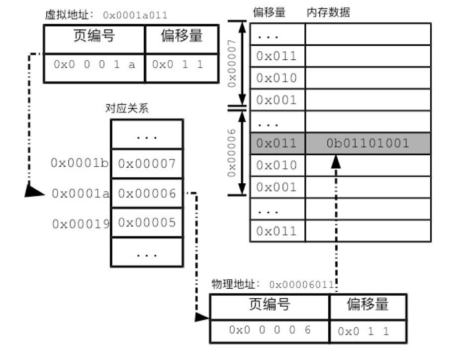
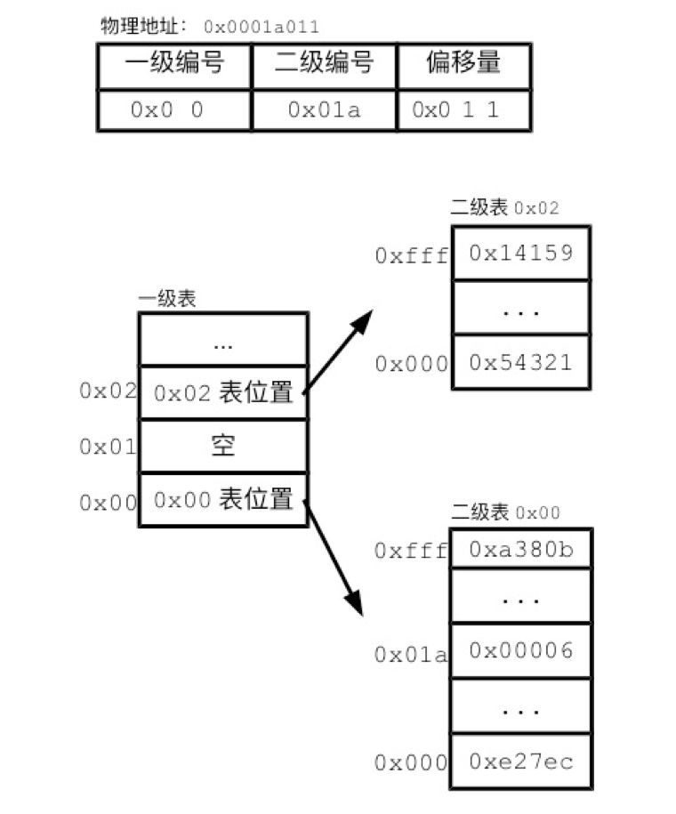

### 虚拟内存
> 操作系统引入了虚拟内存，进程持有的虚拟地址会通过 CPU 芯片中的内存管理单元（MMU）的映射关系，来转换变成物理地址，然后再通过物理地址访问内存
> MMU 管理虚拟地址与物理地址方式 (内存分段和内存分页)  
> 每个进程都有自己的一套虚拟内存地址，用来给自己的进程空间编号

#### 内存分段

分段机制下，虚拟地址和物理地址是如何映射的？

分段机制下的虚拟地址由两部分组成，`段选择子`和`段内偏移量`

段选择子就保存在段寄存器里面。段选择子里面最重要的是段号，用作段表的索引。段表里面保存的是这个段的基地址、段的界限和特权等级等  

虚拟地址中的段内偏移量应该位于 0 和段界限之间，如果段内偏移量是合法的，就将段基地址加上段内偏移量得到物理内存地址。

构成图：  

##### 不足之处：

- 内存碎片
> 分段后的应用销毁后，其分段(堆、栈、数据、代码)所占用的连续地址，不一定能满足下个应用需要的内存空间，所以，这些段地址就无法充分使用，遗留造成了内存碎片

- 内存交换的效率低
> 解决外部内存碎片的问题就是内存交换  
> 产生了内存碎片，那不得不重新 Swap 内存区域，这个过程会产生性能瓶颈。
> 如果内存交换的时候，交换的是一个占内存空间很大的程序，这样整个机器都会显得卡顿

#### 内存分页

> 分页是把整个虚拟和物理内存空间切成一段段固定尺寸的大小。这样一个连续并且尺寸固定的内存空间，我们叫页（Page）。在 Linux 下，每一页的大小为 4KB。

##### 分页是怎么解决分段的内存碎片、内存交换效率低的问题？

采用了分页，那么释放的内存都是以页为单位释放的，也就不会产生无法给进程使用的小内存。

> 如果内存空间不够，操作系统会把其他正在运行的进程中的「最近没被使用」的内存页面给释放掉，也就是暂时写在硬盘上，称为换出（Swap Out）。  
> 一旦需要的时候，再加载进来，称为换入（Swap In）。  
> 所以，一次性写入磁盘的也只有少数的一个页或者几个页，不会花太多时间，内存交换的效率就相对比较高。  

##### 分页机制下，虚拟地址和物理地址是如何映射逻辑

在分页机制下，虚拟地址分为两部分，页号和页内偏移。页号作为页表的索引，页表包含物理页每页所在物理内存的基地址，这个基地址与页内偏移的组合就形成了物理内存地址

##### 多级分页

**单级分页问题**
- 在 32 位的环境下，虚拟地址空间共有 4GB (2^32)，假设一个页的大小是 4KB（2^12），那么就需要大约 100 万 （2^20） 个页，每个「页表项」`页表中的虚拟页号与物理页号的映射项`需要 4 个字节大小来存储，那么整个 4GB 空间的映射就需要有 4MB 的内存来存储页表。  
- 这 4MB 大小的页表，看起来也不是很大。但是要知道每个进程都是有自己的虚拟地址空间的，也就说都有自己的页表。
那么，100 个进程的话，就需要 400MB 的内存来存储页表，这是非常大的内存了，更别说 64 位的环境了

  

**二级分页**

把这个 100 多万个「页表项」的单级页表再分页，将页表（一级页表）分为 1024 个页表（二级页表），每个表（二级页表）中包含 1024 个「页表项」，形成二级分页

  

